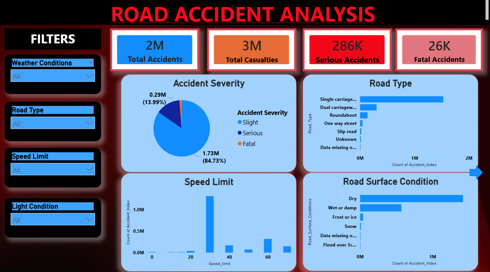
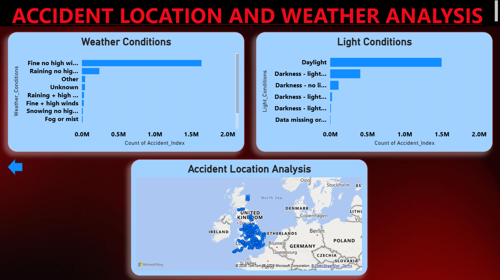

 Project File

You can download the Power BI project file from the link below:

Power BI Dashboard File:  
https://1drv.ms/u/c/d707e583de21d85f/IQC6cRvJJGieSrbeAGTk7rKIARmUqgCjnf-ATO_Q7MJ11Xw?e=wSZUNq

---

## Dataset

The dataset used for this project contains information about road accidents including accident severity, road type, weather conditions, speed limits, light conditions, and road surface conditions.

Dataset Link:  
https://1drv.ms/x/c/d707e583de21d85f/IQB7i6uJZMOaT6mHvj_iAXCQAYgcRsUm4jWZu0JdZtzZg6U?e=oPYmwo

---
# Road Accident Analysis using Power BI

This project was created to analyze road accident data using Power BI.  
The aim of this dashboard is to understand accident patterns and study the factors that influence accidents such as weather conditions, road type, speed limits, and lighting conditions.

By visualizing the accident data through charts and maps, the dashboard helps to easily explore how accidents occur under different road and environmental conditions.

---
## Dashboard Overview

The Power BI dashboard presents accident data using different visualizations. It allows users to explore accident statistics and understand important trends.

### Key Results

- Total Accidents: 2 Million  
- Total Casualties: 3 Million  
- Serious Accidents: 286K  
- Fatal Accidents: 26K  

These numbers give a quick summary of the accident data used in this project.

---

## Analysis Included in the Dashboard

The dashboard includes analysis of:

- Accident severity distribution  
- Road type comparison  
- Weather condition impact on accidents  
- Speed limit vs accident count  
- Road surface condition analysis  
- Light conditions during accidents  
- Accident location visualization using map  

Filters are also included in the dashboard to allow users to explore the data based on different conditions.

---

## Tools Used

- Power BI  
- Excel dataset  
- Power Query for data cleaning  

---

## Dashboard Preview

### Road Accident Analysis Dashboard

### Accident Location and Weather Analysis

---

## Author

Shamitha S M  
BE – Artificial Intelligence and Machine Learning  
Vivekananda College of Engineering and Technology, Puttur

